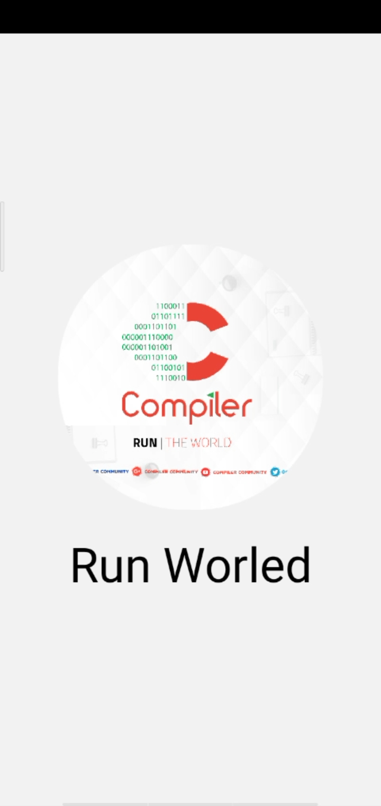
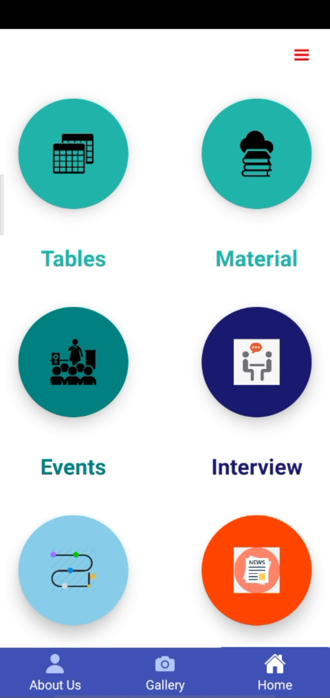
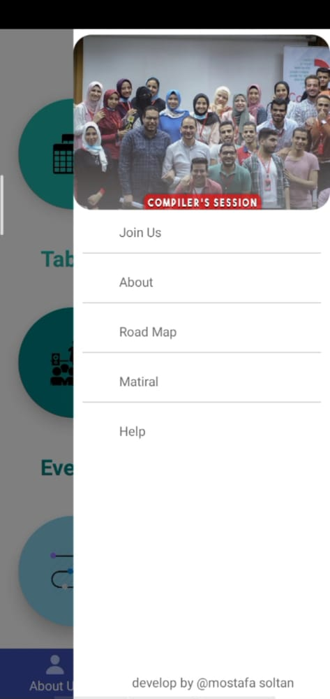

# compiler-community-trial-app
<!-- ABOUT THE PROJECT -->
## About The Project

# React Native application with some useful services for my community
 
 
  

## Technologies

* react native
* async-storage
* firebase
* hooks

### screenshot

 
